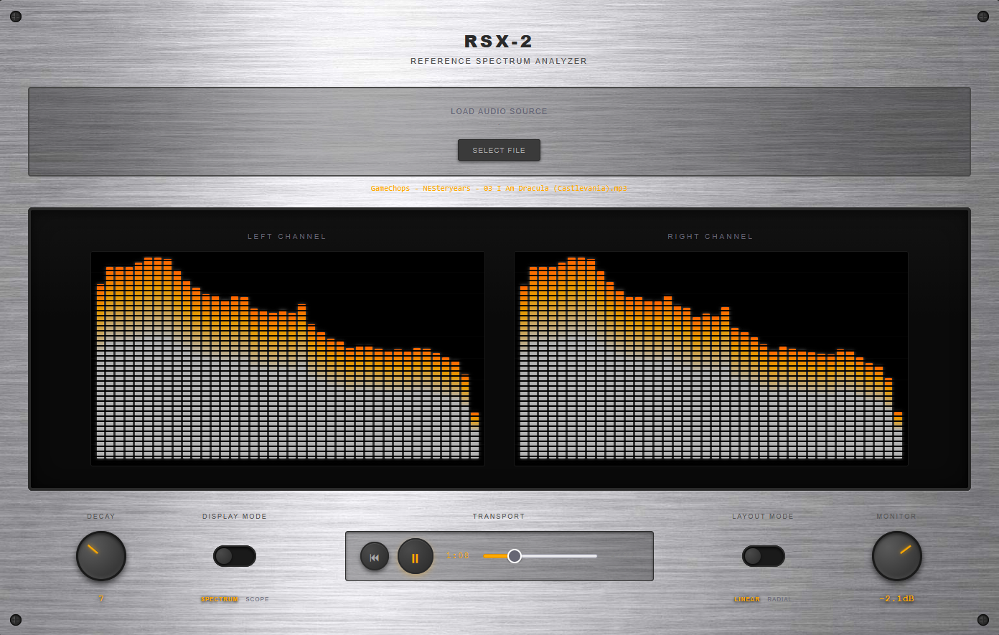

# RSX-2 Reference Spectrum Analyzer


My second week 1 submission for Data Visualizations and Interaction is

[A professional-grade audio FFT visualizer designed to look and feel like high-end studio hardware. The RSX-2 features a brushed aluminum faceplate, precision rotary controls, and real-time stereo spectrum analysis with LED-style display bars.](https://kylephoto.blob.core.windows.net/spring-into-ai/fft/index.html)

## Features

### Visual Design
- **Hardware-inspired aesthetics** - Brushed metal texture, corner fasteners, and recessed glass display
- **Dual-channel visualization** - Independent left and right channel spectrum analyzers
- **40-band logarithmic FFT** - Frequency range from 20Hz to 20kHz
- **LED-style bars** - White gradient bars with amber peak indicators
- **Dual display modes** - Switch between Spectrum (frequency) and Scope (waveform) views
- **Dual layout modes** - Choose between Linear bars and Radial circular visualization
- **Subtle grid overlay** - Professional measurement reference lines

### Interactive Controls

#### Decay Knob
- Controls the fall rate of spectrum bars (1-20)
- Orbital drag interaction - move mouse in circular motion around knob
- Adjusts visual persistence of frequency data

#### Monitor Knob
- Master volume control (-30dB to +10dB)
- Affects both left and right channels
- **Double-click to reset to 0dB** (unity gain)
- Orbital drag interaction

#### Display Mode Toggle
- Switch between **Spectrum** (frequency analysis) and **Scope** (waveform/oscilloscope)
- Spectrum mode shows frequency content with 40 logarithmic bands
- Scope mode displays time-domain waveform with phosphor-style persistence effect
- Decay control affects persistence in both modes

#### Layout Mode Toggle
- Switch between **Linear** (traditional bar graph) and **Radial** (circular) layouts
- Linear mode: Classic horizontal spectrum bars
- Radial mode: Circular visualization with rotating animation
- Both modes support Spectrum and Scope displays

#### Transport Controls
- **Play/Pause** - Start/stop audio playback
- **Restart** - Jump back to beginning
- **Progress bar** - Seek to any position in the track
- **Time display** - Current time and total duration

#### Test Mode (Developer Feature)
- Optional button in top-right corner (controlled by `ENABLE_TEST_MODE` constant)
- Generates and freezes realistic random audio data for testing
- Useful for development and demonstration without audio files
- Works across all display and layout modes

### Hover Tooltips
Hover over any frequency bar to see:
- **Frequency range** (e.g., "120-250 Hz" or "5.0-10.5 kHz")
- **Current amplitude** (0-255 scale)
- **Energy percentage** - Relative energy contribution to total spectrum

## Usage

1. **Load Audio File**
   - Click "Select File" or drag & drop an MP3/audio file onto the drop zone
   - Supported formats: MP3, WAV, and other browser-compatible audio formats

2. **Control Playback**
   - Click the play button to start
   - Adjust the Monitor knob to control volume
   - Use the progress bar to seek through the track

3. **Switch Display Modes**
   - Toggle between Spectrum and Scope modes
   - Spectrum: See frequency content across 40 bands
   - Scope: View waveform shape in real-time

4. **Switch Layout Modes**
   - Toggle between Linear and Radial visualizations
   - Linear: Traditional horizontal bar layout
   - Radial: Circular spinning visualization

5. **Adjust Visualization**
   - Turn the Decay knob to control how quickly bars fall (Spectrum) or waveform fades (Scope)
   - Higher values = slower decay/more persistence
   - Lower values = faster decay/more responsive

6. **Analyze Frequencies**
   - Hover over bars (in Spectrum mode) to see detailed frequency information
   - Left and right channels are analyzed independently
   - Watch for amplitude differences between channels

## Technical Details

- **FFT Size**: 2048 samples
- **Frequency Bands**: 40 logarithmic bands (Spectrum mode)
- **Frequency Range**: 20Hz - 20kHz
- **Sample Rate**: Derived from audio source
- **Smoothing**: 0.8 time constant on frequency analysis
- **Stereo Processing**: Independent left/right channel analysis via Web Audio API
- **Display Modes**:
  - Spectrum: Frequency domain analysis (FFT)
  - Scope: Time domain waveform display
- **Layout Modes**:
  - Linear: Traditional bar visualization
  - Radial: Circular visualization with continuous rotation
- **Radial Animation**: 0.002 radians/frame rotation speed

## Audio Graph

```
Audio Element
    ↓
Media Element Source
    ↓
Gain Node (Monitor control)
    ↓
Channel Splitter
    ├─→ Analyzer (Left) → Visualizer
    └─→ Analyzer (Right) → Visualizer
```

## Requirements

- Modern web browser with Web Audio API support (Chrome, Firefox, Safari, Edge)
- Local audio files (MP3, WAV, etc.)
- `brushed-metal-texture.jpg` for hardware aesthetic

## File Structure

```
fft/
├── index.html                 # Complete single-file application
├── brushed-metal-texture.jpg  # Brushed metal background texture
└── README.md                  # This file
```

## Controls Summary

| Control | Action | Function |
|---------|--------|----------|
| **Decay Knob** | Orbital drag | Adjust bar fall rate / waveform persistence (1-20) |
| **Decay Knob** | Double-click | Reset to default (10) |
| **Display Mode Toggle** | Click | Switch between Spectrum and Scope |
| **Layout Mode Toggle** | Click | Switch between Linear and Radial |
| **Monitor Knob** | Orbital drag | Adjust volume (-30dB to +10dB) |
| **Monitor Knob** | Double-click | Reset to 0dB |
| **Play/Pause** | Click | Toggle playback |
| **Restart** | Click | Return to start |
| **Progress Bar** | Click/drag | Seek to position |
| **Spectrum Bars** | Hover | Show frequency details (Linear Spectrum mode) |
| **Test Mode** | Click | Toggle random test data (if enabled) |

## Design Philosophy

The RSX-2 is designed to feel less like a software widget and more like a precision instrument built for a mastering room. The brushed aluminum faceplate, exposed black fasteners, and machined control knobs communicate weight and permanence, while the recessed glass display window gives the LED spectrum bars a sense of depth and focus. Each channel is presented symmetrically for critical stereo evaluation, with restrained white LED ladders and subtle amber peak indicators emphasizing accuracy over flash. The rotary gain and decay controls evoke analog signal flow, reinforcing the idea that this is not just a visualizer, but a monitoring tool intended for deliberate listening.

The addition of multiple display modes (Spectrum/Scope) and layout modes (Linear/Radial) expands the RSX-2 from a single-purpose analyzer into a versatile monitoring station. The oscilloscope mode provides the traditional time-domain view essential for phase analysis and transient inspection, while the radial mode offers a modern circular visualization that maintains the hardware aesthetic while exploring new spatial arrangements of the frequency data.

---

Built with vanilla JavaScript and the Web Audio API. No frameworks, no dependencies.
